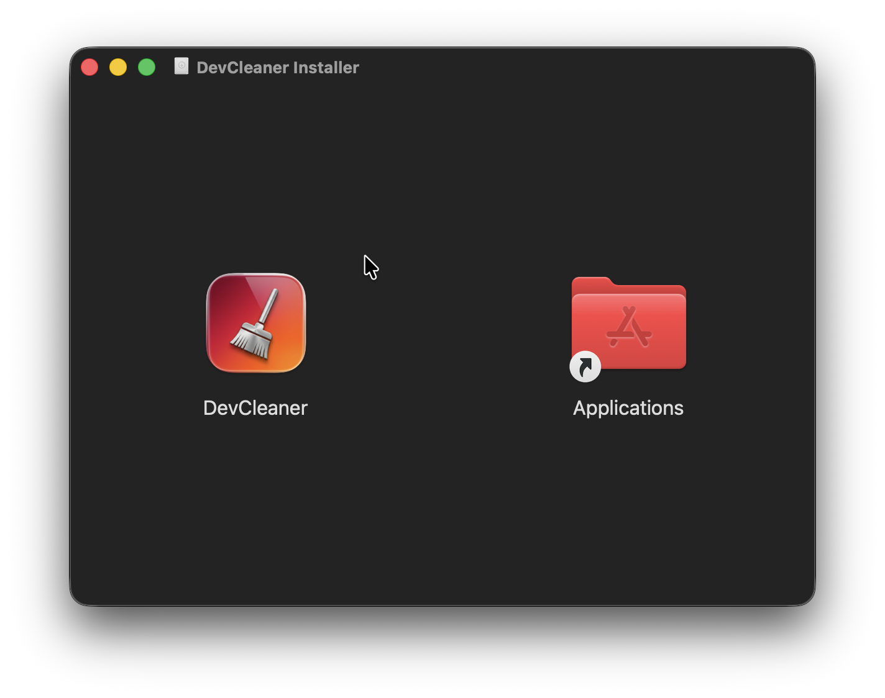
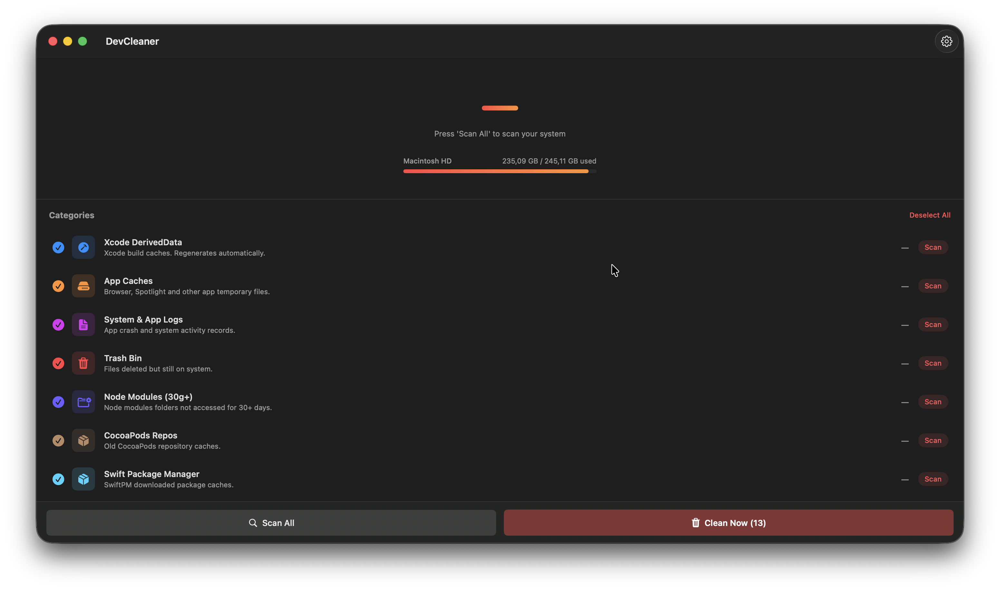
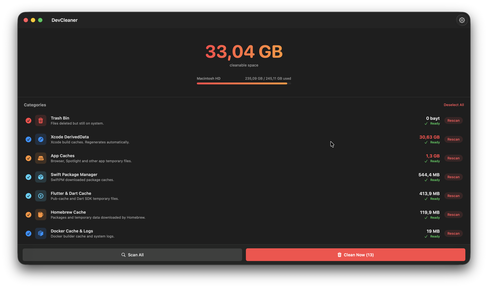

# DevCleaner 

## 🇺🇸 English

DevCleaner is a lightweight and high-performance dashboard designed for macOS-based developers to clean up massive amounts of cache and log files that accumulate during the development process. 

### Download
You can download the latest version of DevCleaner as a **.dmg** file from the **[Releases](https://github.com/aliakpoyraz/DevCleaner/releases)** section.






### Key Features
- **Simplified Dashboard**: A single-view architecture for focused cleanup.
- **Disk Space Insights**: Real-time display of your system drive name and used/total storage.
- **Smart Scanning**: Automatically identifies `node_modules` folders older than 30 days.
- **Privacy Centric**: Uses secure, App Sandbox compliant file access methods.
- **Premium Aesthetics**: A modern Red-Orange themed UI with smooth transitions.

### Tech Stack
- **Language**: Swift 5.10+
- **Framework**: SwiftUI
- **Architecture**: MVVM
- **Access**: Security-Scoped Bookmarks (macOS App Sandbox)

### Scanned Directories
The application precisely scans and manages the following locations:
- **Xcode DerivedData**: `~/Library/Developer/Xcode/DerivedData`
- **User Cache Files**: `~/Library/Caches`
- **System & App Logs**: `~/Library/Logs` & `/Library/Logs`
- **Trash Bin**: `~/.Trash`
- **Old Node Modules**: Recursive search for `node_modules` (30+ days of inactivity)
- **CocoaPods Repos**: `~/.cocoapods/repos`
- **Swift Package Manager**: `~/Library/Caches/org.swift.swiftpm`
- **Simulator Devices**: `~/Library/Developer/CoreSimulator/Devices`
- **Mail Downloads**: `~/Library/Containers/com.apple.mail/Data/Library/Mail Downloads`
- **PostgreSQL Logs**: `/usr/local/var/log/postgresql`
- **MySQL Logs**: `/usr/local/var/log/mysql`
- **Homebrew Cache**: `~/Library/Caches/Homebrew`
- **Docker Artifacts**: `~/Library/Containers/com.docker.docker/Data/vms/0/data/`
- **Flutter & Dart**: `~/.pub-cache` & `~/Library/Caches/DartStore`

### Installation
1. Clone the repository:
   ```bash
   git clone git@github.com:aliakpoyraz/DevCleaner.git
   ```
2. Open `DevCleaner.xcodeproj` in Xcode.
3. Select your development team in **Signing & Capabilities**.
4. Press **Run (⌘+R)** to build and launch.

---

## 🇹🇷 Türkçe

DevCleaner, macOS kullanan yazılım geliştiricilerin (iOS, Web, Backend) süreç içerisinde sistemlerinde biriken devasa boyutlardaki önbellek ve log dosyalarını zahmetsizce temizlemeleri için geliştirilmiş yüksek performanslı bir araçtır.

### İndir
DevCleaner'ın son sürümünü **.dmg** dosyası olarak **[Releases (Sürümler)](https://github.com/aliakpoyraz/DevCleaner/releases)** bölümünden kolayca indirebilirsiniz.

### Öne Çıkan Özellikler
- **Sadeleştirilmiş Panel**: Karmaşadan uzak, tek ekranlı dashboard mimarisi.
- **Disk Analizi**: Sistem birim adını ve "Kullanılan / Toplam" alan bilgisini anlık gösterir.
- **Akıllı Tarama**: 30 günden eski `node_modules` klasörlerini otomatik olarak tespit eder.
- **Güvenlik Odaklı**: App Sandbox uyumlu, güvenli dosya erişim yöntemlerini kullanır.
- **Premium Tasarım**: Kırmızı-Turuncu gradyanlarla modern ve akıcı bir arayüz.

### Teknoloji Yığını
- **Dil**: Swift 5.10+
- **Framework**: SwiftUI
- **Mimari**: MVVM
- **Erişim**: Security-Scoped Bookmarks (macOS App Sandbox)

### Taranan Dizinler
Uygulama aşağıdaki dizinleri hassas bir şekilde tarar ve yönetir:
- **Xcode DerivedData**: `~/Library/Developer/Xcode/DerivedData`
- **Kullanıcı Önbellekleri**: `~/Library/Caches`
- **Sistem ve Uygulama Logları**: `~/Library/Logs` & `/Library/Logs`
- **Çöp Kutusu**: `~/.Trash`
- **Eski Node Modules**: 30 günden uzun süredir dokunulmamış `node_modules` klasörleri.
- **CocoaPods Repoları**: `~/.cocoapods/repos`
- **Swift Package Manager**: `~/Library/Caches/org.swift.swiftpm`
- **Simülatör Cihazları**: `~/Library/Developer/CoreSimulator/Devices`
- **Mail İndirmeleri**: `~/Library/Containers/com.apple.mail/Data/Library/Mail Downloads`
- **PostgreSQL Logları**: `/usr/local/var/log/postgresql`
- **MySQL Logları**: `/usr/local/var/log/mysql`
- **Homebrew Önbelleği**: `~/Library/Caches/Homebrew`
- **Docker Dosyaları**: `~/Library/Containers/com.docker.docker/Data/vms/0/data/`
- **Flutter ve Dart**: `~/.pub-cache` & `~/Library/Caches/DartStore`

### Kurulum Adımları
1. Repoyu klonlayın:
   ```bash
   git clone git@github.com:aliakpoyraz/DevCleaner.git
   ```
2. `DevCleaner.xcodeproj` dosyasını Xcode ile açın.
3. **Signing & Capabilities** kısmından kendi geliştirici ekibinizi seçin.
4. **Run (⌘+R)** tuşuna basarak uygulamayı derleyin ve çalıştırın.

---
